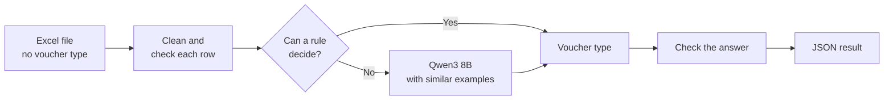
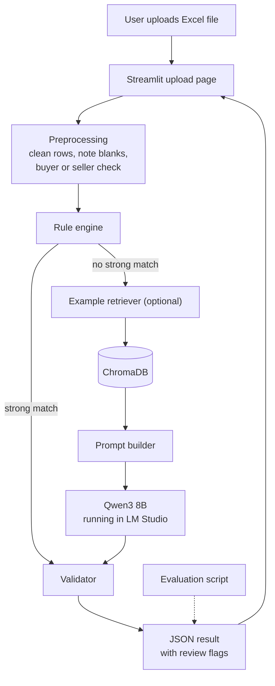
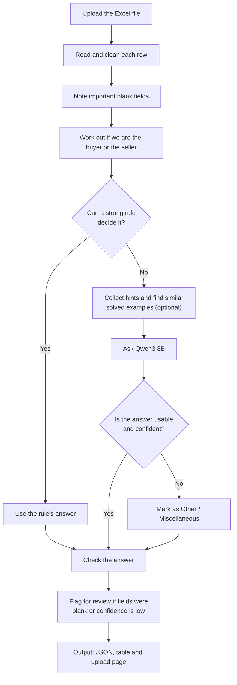

# Intelligent Voucher Classification

**Using open-source LLMs**

An AI system that reads a financial transaction and works out which accounting voucher it belongs to. It runs on a local open-source model, so no paid cloud AI is needed.

Built for the **Hacktober Fest Open Source AI Hackathon** (qualifier round).
Challenge: Problem 4, *VYOM+ Intelligent Voucher Classification Using Open-Source LLMs*.

---

## Table of Contents

1. [Project Name](#1-project-name)
2. [Problem Statement](#2-problem-statement)
3. [Project Overview](#3-project-overview)
4. [Proposed Solution](#4-proposed-solution)
5. [Objectives](#5-objectives)
6. [Target Users / Use Case](#6-target-users--use-case)
7. [Open-Source AI Technology Selected](#7-open-source-ai-technology-selected)
8. [Why This Technology Was Selected](#8-why-this-technology-was-selected)
9. [AI's Role in the System](#9-ais-role-in-the-system)
10. [System Architecture](#10-system-architecture)
11. [Component-Level Architecture](#11-component-level-architecture)
12. [Data / Information Flow](#12-data--information-flow)
13. [Agentic Workflow](#13-agentic-workflow)
14. [Technology Stack](#14-technology-stack)
15. [Expected Features](#15-expected-features)
16. [Implementation Approach](#16-implementation-approach)
17. [Expected Final Output](#17-expected-final-output)
18. [Future Scope / Scalability](#18-future-scope--scalability)
19. [Open-Source Dependencies / Components](#19-open-source-dependencies--components)
20. [Expected Challenges and Mitigation](#20-expected-challenges-and-mitigation)

---

## 1. Project Name

**Intelligent Voucher Classification**

It is a voucher classification system that reads structured transaction data and predicts the right accounting voucher type for each row. It mixes plain accounting rules with a locally hosted open-source language model, so easy cases are handled quickly and tricky ones get proper reasoning.

---

## 2. Problem Statement

Every business transaction has to be recorded under the right **voucher type**, such as Purchase, Sales or Payment. The type decides which books the entry goes into. A wrong label puts the entry in the wrong place, and the mistake usually shows up much later.

Today this labelling is mostly done by hand. The input for this challenge is an Excel file where each row is a transaction. The rows can contain details such as:

- supplier and customer
- invoice number and date
- item descriptions and quantities
- taxable value, GST, discounts and freight
- payment, debit and credit information
- return, order and delivery references
- payroll, inventory movement, and import or export details

The **voucher type column has been removed on purpose.** Our job is to work it out from the other fields.

**The 27 voucher types we must choose from**

| Group | Voucher types |
|---|---|
| Buying and selling | Purchase, Sales, Purchase Return / Debit Note, Sales Return / Credit Note, Import, Export |
| Money | Payment, Receipt, Contra, Advance / Prepayment, Expense |
| Orders and goods papers | Purchase Order, Sales Order, Receipt Note, Delivery Note, Rejection In, Rejection Out |
| Stock | Stock Journal, Physical Stock, Material In, Material Out, Job Work In Order, Job Work Out Order |
| People | Salary / Payroll, Attendance |
| Everything else | Journal, Other / Miscellaneous |

**Why it is hard**
Many of these types look almost the same in the data.

- Purchase and Sales can have the same item and the same amount. Only the direction is different, meaning whether we are the buyer or the seller.
- A Purchase Return and a Sales Return are mirror images of each other.
- A transfer between our own bank and cash (Contra) can look like a Payment or a Receipt.
- Moving stock between our own godowns can look like a purchase or a sale.

Searching for keywords doesn't work here. The system has to read the **whole row** and understand what actually happened.

This is **not** an OCR or invoice-reading task. The data is already structured. All the difficulty is in the accounting reasoning.

---

## 3. Project Overview

**Input:** an Excel (.xlsx) file of transactions with no voucher type.

**Output:** one voucher type for every row, as JSON, with a confidence score and a short reason. Rows that look unreliable are flagged for review.

**How it works, in short**



1. We read the Excel file and clean each row.
2. We work out which side our company is on (buyer or seller) and note any important blank fields.
3. Clear cases are settled by simple accounting rules. For example, a row with employee pay details is salary.
4. For the harder rows, the open-source model **Qwen3 8B** reads the whole row, together with similar solved examples if retrieval is switched on, and picks a type.
5. We check every answer. It must be one of the 27 types and it must be confident enough.
6. The result goes out as JSON and is shown on a simple upload page.

The company ("we") is a setting in the system. In our test data it is **The Boys Traders**.

---

## 4. Proposed Solution

We use a **rule-first hybrid** approach. We don't ask the language model to classify everything. The accounting rules go first, and the model is only used for rows the rules can't settle.

**The steps**

1. **Clean the data.** Dates, amounts and company names are put into one standard form. Important blank fields are noted.
2. **Check the buyer or seller side.** Code checks whether our company is the buyer, the seller, both, or neither, and passes it on as a plain fact. This turns Purchase vs Sales into something the model doesn't have to guess.
3. **Apply the rules.** Strong rules decide the row straight away. Weaker rules only add a hint for the model.
4. **Find similar examples (optional).** For hard rows, the system looks up a few similar rows we have already labelled and shows them to the model.
5. **Ask the model.** Qwen3 8B reads the row, the hints, the voucher definitions and the examples, and returns one type.
6. **Check the answer.** Anything invalid or unsure is marked Other / Miscellaneous and flagged for review.

**Examples of strong rules**

| If the row has... | Then the voucher is... |
|---|---|
| Employee pay details (gross pay, deductions, net pay) | Salary / Payroll |
| Employee days present or leave, with no money | Attendance |
| Foreign currency together with customs details | Import or Export, depending on whether we are the buyer or the seller |
| Money moving between our own cash and bank accounts | Contra |
| Stock moving between our own godowns, with no outside party and no price | Stock Journal |
| A counted quantity that differs from the book quantity | Physical Stock |

The exact rules will be tested and adjusted against our own sample rows.

**Why a mix of rules and AI**

- Rules alone break down when fields are missing, when several types share the same fields, or when the signals point in different directions.
- A model alone can give different answers to the same row, wastes effort on obvious cases, and is harder to test.
- Together they are predictable on the clear cases and flexible on the hard ones.

---

## 5. Objectives

1. Pick the right voucher type for every transaction, out of all 27.
2. Read several fields together instead of relying on single keywords.
3. Tell lookalike types apart: Purchase vs Sales, Purchase Return vs Sales Return, Payment vs Receipt, Contra vs Payment or Receipt, and Purchase vs Stock Journal.
4. Use an open-source model that runs locally, with no paid cloud AI as the main classifier.
5. Mix clear accounting rules with model reasoning.
6. Return clean JSON for every row: document number, voucher type, confidence and a short reason.
7. Cope with blank, incomplete or contradictory data, and flag those rows instead of guessing silently.
8. Measure the results on rows the system hasn't seen, using accuracy, precision, recall and F1 (overall and per category).
9. Keep the design easy to extend later, for example with more examples, better retrieval or fine-tuning.

---

## 6. Target Users / Use Case

**Who this helps**

| User | What they get |
|---|---|
| Accountants | Less repetitive labelling and fewer wrong entries |
| CA firms | A more consistent way to handle large volumes of client transactions |
| Small traders and businesses | Monthly records classified without heavy accounting software |
| ERP and accounting software vendors | A local classification step that can be built into existing workflows |

**The problem today**
Someone sits with the transaction sheet and picks a voucher type for each row by hand. It is slow, and some types are easy to confuse. A wrong pick doesn't fail loudly. The entry lands in the wrong books and somebody finds out weeks later.

**A typical use**
The Boys Traders exports last month's transactions to Excel, and the voucher type column is blank. They upload the file and get a type back for every row, with a confidence score and a short reason. The few rows the system isn't sure about are marked for review, so the accountant checks those instead of going through the whole month.

**Why keywords aren't enough**
Take a cash deposit into the bank. The narration might say "cash payment slip", but the money only moved between our own accounts, so it is a Contra entry and not a Payment. Or take two rows with the same item and the same amount, one where we bought and one where we sold. A keyword can't tell them apart. The direction can.

---

## 7. Open-Source AI Technology Selected

We use **Qwen3 8B**, an open-source language model, running on our own machines through **LM Studio**. We don't depend on a paid cloud AI service.

Most rows are settled by our accounting rules. The model steps in when the rules can't decide. For each of those rows it is given:

- the row's fields in a clean, structured form
- the buyer or seller side, and any hints from the rules
- the definitions of the voucher types
- a few similar, already-labelled rows from ChromaDB (optional)
- an instruction to answer with one of our 27 voucher types only

**Technologies used**

| Technology | What it is | What it does here |
|---|---|---|
| Qwen3 8B | Open-source language model, about 8 billion parameters, Apache 2.0 license | Classifies the rows the rules can't settle |
| LM Studio | Desktop tool for running models locally | Runs Qwen3 8B on our machines and serves it to our app |
| ChromaDB (optional) | Open-source vector database | Stores labelled examples and finds similar ones |
| Sentence Transformers (optional) | Open-source embedding library, with a small model such as all-MiniLM-L6-v2 | Turns rows into numbers so similar rows can be found |
| Python, pandas, openpyxl | Programming language and data libraries | Reads the Excel file and ties everything together |
| scikit-learn | Machine learning library | Calculates accuracy, precision, recall and F1 |
| Streamlit | Python web app library | The simple upload page |

We are not fine-tuning the model in this prototype. Fine-tuning with LoRA or QLoRA is something we would like to try later.

---

## 8. Why This Technology Was Selected

We picked Qwen3 8B with LM Studio because this task needs more than keyword matching. Something has to read a transaction as a whole and work out what kind of voucher it is.

**1. It copes with lookalike types.**
Purchase vs Sales, Purchase Return vs Sales Return, Payment vs Receipt, Contra vs Payment or Receipt, and Purchase vs Stock Journal all share similar fields. A model can look at several fields together, which a single keyword can't do.

**2. The size suits a laptop.**
Qwen3 comes in several sizes. The 8B size is large enough to reason over a whole row and small enough to run locally in a compressed (quantised) form, which is roughly 5 GB. Smaller Qwen3 sizes are our fallback if a team laptop is too slow.

**3. It has a thinking switch.**
Qwen3 can work in a "thinking" mode that reasons at length, or in a faster "non-thinking" mode. Our task is classification with short answers, so we plan to use the faster mode. That keeps each row quick and answers more consistent.

**4. The license is open.**
Qwen3 8B is released under the Apache 2.0 license, which allows free use, changes and sharing. That fits the challenge, which asks for an open-source or openly available model as the main classifier.

**5. It runs locally.**
Financial data stays on our machine, there is no per-call cost, and it works offline. That also makes the demo easier, because everything is in a setup we control.

**6. LM Studio keeps setup simple.**
It lets us download and run the model without writing server code, and it can serve the model to our Python app. If we later need a fully open-source runtime, we can switch to Ollama or llama.cpp without changing the rest of the design.

**7. The output can be controlled.**
The model has to answer with one of our 27 types, in a fixed JSON format. We check both before accepting a result.

**8. The mixed design keeps model use low.**
Clear rows are settled by rules, so the model only sees the hard ones. That means fewer model calls and more predictable behaviour.

**9. We don't need fine-tuning yet.**
We don't have a large labelled dataset. Prompting, rules and a small set of labelled examples are enough to build a first working version. We will test on our own labelled sample rows and compare options in the final round.

---

## 9. AI's Role in the System

The AI handles the **ambiguous rows**, the ones our rules can't classify with confidence. We don't send every row to the model. The rules run first, and the AI is a second stage that picks up what they couldn't settle.

**What the model is given**

- the row's fields in structured form
- buyer and seller information, including whether we are the buyer or the seller
- amounts and GST details
- hints picked up during preprocessing and by the weaker rules
- the list of allowed voucher types
- similar labelled examples, if retrieval is on
- clear instructions on how to answer

**What the model returns**

```json
{
  "invoice_number": "INV-2026-1042",
  "voucher_type": "Purchase",
  "confidence": 0.91,
  "reason": "The Boys Traders is the buyer, and the row has items and GST consistent with a purchase."
}
```

This is an example of the format, not a real result.

**What the model does not do**

- It does not decide who "we" are. Code does that.
- It does not do the checks on allowed types, required fields or arithmetic. Code does that.
- It does not settle the clear cases. The rules do that.

**Why AI is needed**
Rules alone struggle when several voucher types share the same fields, when information is missing, when different signals point in different directions, and when the answer depends on reading several fields together. The model handles those cases by looking at the whole row. It doesn't replace the accounting rules. It covers the cases where the rules aren't enough.

---

## 10. System Architecture



The system has five parts:

- **Input and preprocessing.** Reads the Excel file, cleans the rows, notes blank fields and checks the buyer or seller side.
- **Rule engine.** Settles the clear cases. Rows it can't settle move on.
- **Retrieval and model.** For hard rows, finds similar labelled examples (optional) and asks Qwen3 8B.
- **Validation.** Checks every answer and flags rows that need a human look.
- **Output and evaluation.** Returns JSON, shows the results on the upload page, and scores predictions against rows with known answers.

If retrieval is switched off, the "no strong match" path goes straight from the rule engine to the prompt builder.

---

## 11. Component-Level Architecture

| Component | What it does |
|---|---|
| Excel loader | Reads the transaction file into a table |
| Cleaner | Standardises dates, amounts and names, and handles blank values |
| Blank-field checker | Notes which important fields are empty |
| Buyer or seller check | Works out which side our company is on, using a list of spellings of the company name |
| Rule engine | Settles clear cases and produces hints for the rest |
| Example retriever (optional) | Finds similar labelled rows in ChromaDB |
| Prompt builder | Puts the row, hints, definitions and examples into one prompt |
| Qwen3 8B in LM Studio | Reads the prompt and picks one voucher type |
| Validator | Checks the answer is valid, complete and confident enough |
| Fallback handler | Sends invalid or unsure answers to Other / Miscellaneous with a review flag |
| JSON generator | Produces the standard output record |
| Streamlit page | Lets an evaluator upload a file and look at the results |
| Evaluation script | Calculates accuracy, precision, recall and F1 |

**Design principle: each part has one job.**

- Rules make the clear decisions.
- Retrieval provides examples.
- Qwen3 8B does the reasoning.
- LM Studio runs the model.
- The validator checks the answer.
- The JSON generator makes the output.

Keeping the jobs separate makes the system easier to test, fix and extend.

---

## 12. Data / Information Flow

This is what happens to every row, step by step.



**The steps in plain words**

1. We read the Excel file and clean each row, so dates, amounts and company names look the same everywhere.
2. We note which important fields are blank, for example no amount, or no buyer and seller. A blank isn't a problem by itself, but these rows get flagged at the end.
3. We work out which side our company is on: the buyer, the seller, both, or neither. The model is handed this as a plain fact, so it doesn't have to guess. If the file doesn't say which company is ours, we assume it is the party that appears most often.
4. If a strong rule can settle the row alone, we use it and skip the model. A row with employee pay details, for example, is always salary.
5. If not, we gather a few weaker hints and, if retrieval is on, look up some similar rows we've already labelled.
6. We give Qwen3 8B the row, the hints and the examples, and it picks one voucher type.
7. We check the answer. If it isn't one of the 27 types, or the model isn't confident, the row becomes Other / Miscellaneous.
8. Any row with important blank fields or low confidence gets a review flag. Every row goes out as JSON, in a table and on the upload page.

**One row, start to finish**
Here's one row followed through the system. This is how we expect it to behave, not a recorded run.

| Step | What happens |
|---|---|
| Input | A debit note numbered DN-0007. The seller is Sharma Traders and the buyer is The Boys Traders. 20 plastic storage containers, 4,000 before tax and 720 GST. It refers back to invoice INV-S-1042. The note says 20 units were damaged in transit and sent back to the supplier. |
| Cleaning | Dates, amounts and names are put into one standard format. |
| Blank fields | Nothing important is missing, so no flag for this row. |
| Which side are we on | We're the buyer in this row, so the goods are going back to our supplier. |
| Rules | No strong rule settles it. A weak rule does notice that the row refers to an older invoice and talks about returning goods, so it hints that this is a return. |
| Similar examples | If retrieval is on, the system fetches a few already-labelled return rows and shows them to the model. |
| Model | It sees the row, the fact that we're the buyer, the hint and the examples. It replies with a voucher type, a confidence score and a short reason. We expect Purchase Return / Debit Note, because we bought the goods and are sending them back. |
| Check | The answer is one of the 27 types and the confidence is high enough, so it's accepted. |
| Output | A JSON record and a row in the results table on the upload page. |

**When the data is messy**

- **Blank fields.** Blanks are allowed, because real data will have them. We don't ignore them, though. If an important field is empty, the row still gets an answer, but it's flagged as needing review and the output lists which fields were missing. Not every blank is a problem. A salary row has no seller, and that's normal, so we only flag the fields that matter for that kind of row.
- **Narration that disagrees with the fields.** We trust the structured fields over the free text. If the narration says "sale of goods" but The Boys Traders is the buyer, we don't treat it as a sale.
- **Output we can't use.** If the model returns broken JSON or a type outside the 27, we try once more. If that fails too, the row goes to Other / Miscellaneous with a review flag.

A flagged row would look like this. It's an example of the format, not a real result.

```json
{
  "invoice_number": "INV-S-1050",
  "voucher_type": "Purchase",
  "confidence": 0.6,
  "reason": "The Boys Traders is the buyer, but items and amounts are missing.",
  "needs_review": true,
  "missing_fields": ["item_description", "taxable_value", "date"]
}
```

---

## 13. Agentic Workflow

The system is a **staged workflow**, not a free-roaming autonomous agent. Every row goes through the same controlled sequence: rules, then the model, then checks. The system doesn't choose its own tools or invent its own steps.

| Decision point | Condition | What happens |
|---|---|---|
| Rule check | A strong rule matches | The rule's answer is used and the model is skipped |
| Hints | Only weaker rules match | They are passed to the model as hints |
| Retrieval (optional) | The row goes to the model and retrieval is on | Similar labelled examples are added to the prompt |
| Model answer | The reply is valid JSON and one of the 27 types | The answer moves on to the confidence check |
| Invalid answer | Broken JSON or an unknown type | One retry, then Other / Miscellaneous with a review flag |
| Confidence check | Confidence is below our threshold | The row is flagged for review |
| Blank-field check | Important fields are empty | The row is flagged, with the missing fields listed |

**Stage responsibilities**

| Stage | Job |
|---|---|
| Rules | Handle clear accounting cases and give hints |
| ChromaDB retrieval (optional) | Find relevant labelled examples |
| Qwen3 8B | Pick a voucher type using the whole row |
| Validator | Check the answer |
| Fallback | Handle unsure or invalid results |
| JSON output | Produce a standard result |

Keeping each stage to one fixed job makes the behaviour predictable and each part easy to test. Accounting decisions stay inside our rules and the 27 allowed voucher types.

---

## 14. Technology Stack

We use a light, open-source stack built for running locally.

| Layer | Tool | Purpose |
|---|---|---|
| Language | Python | Core code and glue between the parts |
| Data handling | pandas, openpyxl | Read and clean Excel files |
| Language model | Qwen3 8B | Picks the voucher type for hard rows |
| Model runtime | LM Studio | Runs the model locally and serves it to our code |
| Retrieval (optional) | ChromaDB, Sentence Transformers | Find similar labelled examples |
| Evaluation | scikit-learn | Accuracy, precision, recall, F1, confusion matrix |
| Interface | Streamlit | Upload page and results view |
| Version control | Git, GitHub | Team collaboration |

**Why this stack**

- Python lets us build and change things quickly.
- Qwen3 8B with LM Studio gives local AI reasoning, so no paid API is the core dependency.
- Rules plus the model combine fixed accounting logic with flexible reading of the row.
- Streamlit gives us a working interface with very little code.
- Retrieval is optional. We keep it only if it clearly improves results on our own test rows.

---

## 15. Expected Features

**Core features**

- Reads an Excel file and processes every row in it.
- Picks one voucher type for each row, from the 27 allowed types.
- Works out whether our company is the buyer or the seller in each row, and gives that to the model as a plain fact.
- Uses simple rules for the clear cases, such as rows with employee pay details, foreign-currency rows with customs details, and transfers between our own cash and bank accounts.
- Uses an open-source language model, running locally, to decide the rows the rules can't settle.
- Gives back JSON for every row with the voucher type, a confidence score and a short reason.
- Flags a row for review when important fields are blank or the model isn't confident.
- Checks that every answer is one of the 27 types. If it isn't, the row becomes Other / Miscellaneous.
- Keeps the rules and the spellings of the company name in a simple settings file, so they can be changed without touching the main code.
- Has a simple upload page where an evaluator can upload a file and look at the results.
- Includes an evaluation script that reports accuracy, and precision, recall and F1 for each category, on rows with known answers.
- Adds similar, already-solved examples to the prompt for tricky rows. We build this after the core pipeline works and keep it only if it improves our test results.

**Future features**

- Download the results as an Excel file.
- Highlight the rows that need review on the upload page.
- Filter the results by voucher type or confidence.
- A report showing which similar voucher types get confused with each other.

---

## 16. Implementation Approach

We build the core first and add extras only when the core works.

| Phase | What we build |
|---|---|
| 1. Setup | Install LM Studio, download Qwen3 8B in a compressed (quantised) form, set up Python, and check the model answers a simple test prompt |
| 2. Data layer | Read the Excel file, clean the rows, note blank fields, and add the buyer or seller check |
| 3. Rules | Write the strong rules and the weaker hints, kept in a settings file |
| 4. Model step | Build the prompt (definitions, rules, row), fix the JSON format, switch thinking off, and add the answer checks and one retry |
| 5. Evaluation | Write a script that scores predictions on labelled rows we keep aside, using accuracy, precision, recall, F1 and a confusion matrix |
| 6. Upload page | Build the Streamlit page for uploading a file and viewing results |
| 7. Retrieval (optional) | Store labelled examples in ChromaDB and add similar ones to the prompt |
| 8. Demo | Run the whole thing on unseen rows and prepare the walkthrough |

**Ways we can compare the options**
If time allows, we score a few set-ups on the same labelled rows: rules only, the model only, rules plus the model, and rules plus the model plus retrieval. That shows which part actually helps.

**Where the labelled examples come from**
We write our own labelled sample rows. We keep some aside for testing and never tune on them. The real hidden dataset is not used to build the example store.

**If time runs short**
Drop phase 7 first, then trim the interface. Phases 2 to 5 are the heart of the project.

**What the checks cover**
Every answer is checked for valid JSON, the required fields, one of the 27 allowed types, and a confidence above the threshold we set during testing. Neither the rules nor the model are accepted blindly.

---

## 17. Expected Final Output

The system takes an **Excel (.xlsx) file of transactions** and gives back a voucher type for every row.

**Input**
Fields such as document or invoice number, date, seller and buyer, description, amount and GST, payment details, and inventory or return information. The voucher type is not provided. The system produces it.

**Output**
One of the 27 voucher types for each row, in this format:

```json
{
  "invoice_number": "INV-2026-1042",
  "voucher_type": "Purchase",
  "confidence": 0.91,
  "reason": "The Boys Traders is the buyer, and the row has items and GST consistent with a purchase.",
  "needs_review": false,
  "missing_fields": []
}
```

`invoice_number` and `voucher_type` are always present, so the output can be checked automatically. If a row has no invoice number, its row ID is used instead. This is an example of the format, not a real result.

**Upload page**

Upload an Excel file, then classify the rows, then look at the results.

**What the prototype will deliver**

1. Excel input
2. A voucher type for every row, out of all 27
3. Structured JSON results
4. Checks and error handling, with review flags
5. A confidence score and a short reason for each row
6. A Streamlit page for the demo
7. An evaluation report with accuracy, precision, recall, F1 and per-category scores on unseen labelled rows

---

## 18. Future Scope / Scalability

**Better model**

- Fine-tune the model with LoRA or QLoRA once labelled data is available.
- Handle the hardest voucher types better.
- Learn each organisation's own accounting terms.

**Learning from corrections**
Rows flagged for review can be checked by an accountant. The verified answers can then be added to the example store, so the system improves over time.

**Accounting software integration**
Connect with Tally and other accounting platforms, so classified rows can flow straight into existing workflows.

**Languages**
Support Indian regional languages, mixed-language descriptions and transliteration.

**Customisation**
Let each organisation set its own rules, voucher definitions, reference examples and validation requirements.

**Handling more data**
Process large files in batches, speed up model serving, and keep results in a database.

**Production setup**
The prototype can grow into a frontend, a backend API, model serving, a database and monitoring.

**Beyond classification**
The same base could support voucher creation, transaction checks, spotting exceptions, and prioritising human review. It could also be paired with invoice reading (OCR) so photos and PDFs become classified vouchers end to end.

---

## 19. Open-Source Dependencies / Components

The core system is built from open-source or openly available parts.

| Component | Role | License |
|---|---|---|
| Qwen3 8B | Main language model | Apache 2.0 |
| LM Studio | Runs the model locally | Free to use. The app itself isn't open source, and it can be swapped for Ollama or llama.cpp, which are |
| Python | Core language | PSF license |
| pandas | Data handling | BSD-3-Clause |
| openpyxl | Reading and writing Excel files | MIT |
| scikit-learn | Evaluation metrics | BSD-3-Clause |
| Streamlit | Upload page | Apache 2.0 |
| ChromaDB (optional) | Stores labelled examples | Apache 2.0 |
| Sentence Transformers (optional) | Finds similar rows | Apache 2.0 |
| all-MiniLM-L6-v2 (optional) | Small embedding model | Apache 2.0 |
| Git and GitHub | Version control and collaboration | Tools used for teamwork, not part of the running system |

**Our open-source approach**
Qwen3 8B is the main model and runs locally, so the core pipeline doesn't depend on a proprietary cloud AI API. Optional parts such as retrieval or another model are added only when they are allowed and clearly help.

---

## 20. Expected Challenges and Mitigation

| Challenge | Why it's hard | What we'll do |
|---|---|---|
| Knowing who "we" are | The company name can be spelled differently across rows, or the file may not name our company at all | Keep a list of spellings for our company. If none match, assume the party that appears most often is us |
| Types that look alike | Purchase and Sales, the two returns, and Contra versus Payment or Receipt have almost the same fields | A check in code works out the direction first, and the prompt includes paired examples that show both sides |
| Missing or contradictory fields | Narration can disagree with seller and buyer, and some cells will be empty | Structured fields win over narration. Rows with important blanks or low confidence get a review flag, and a truly unclear row goes to Other / Miscellaneous |
| No labelled data to train on | The real dataset hides the voucher column | Use prompts, rules and a small set of labelled examples we write ourselves. Fine-tuning is left for later |
| Rare types | Job work, rejections and material in or out are easy to mix up | They get their own rules and extra examples |
| Inconsistent model answers | The same row can come back different on different runs | Use the fast non-thinking mode, a very low temperature, a fixed JSON format, a validator and one retry |
| Model confidence isn't exact | A model's own confidence number is only a rough guide | Combine it with our other checks: valid format, allowed type and blank fields. Set the threshold by testing |
| Speed on laptops | An 8B model can be slow without a GPU | Use a quantised version, keep answers short, let rules skip the model, and fall back to a smaller Qwen3 size if needed |
| Testing without the hidden answers | We won't have the real labels while building | Test on our own labelled sample set and keep some rows aside that we never tune on |
| Retrieval may not help | Similar examples can sometimes confuse the model | Treat retrieval as optional and keep it only if it improves our test scores |
| Real definitions may differ from ours | The organisers may label rows differently from how we read Tally | The rules live in an editable settings file, so we can adjust once we see the real data |
